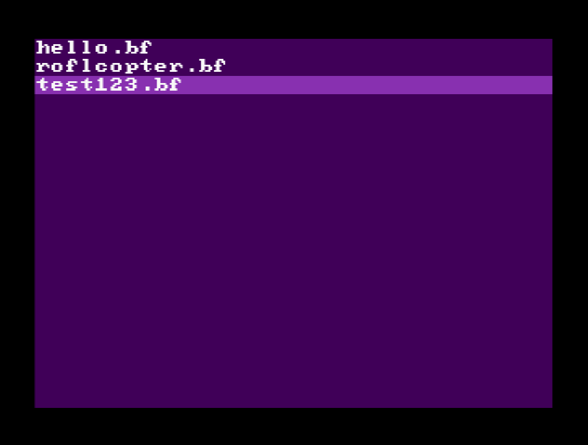
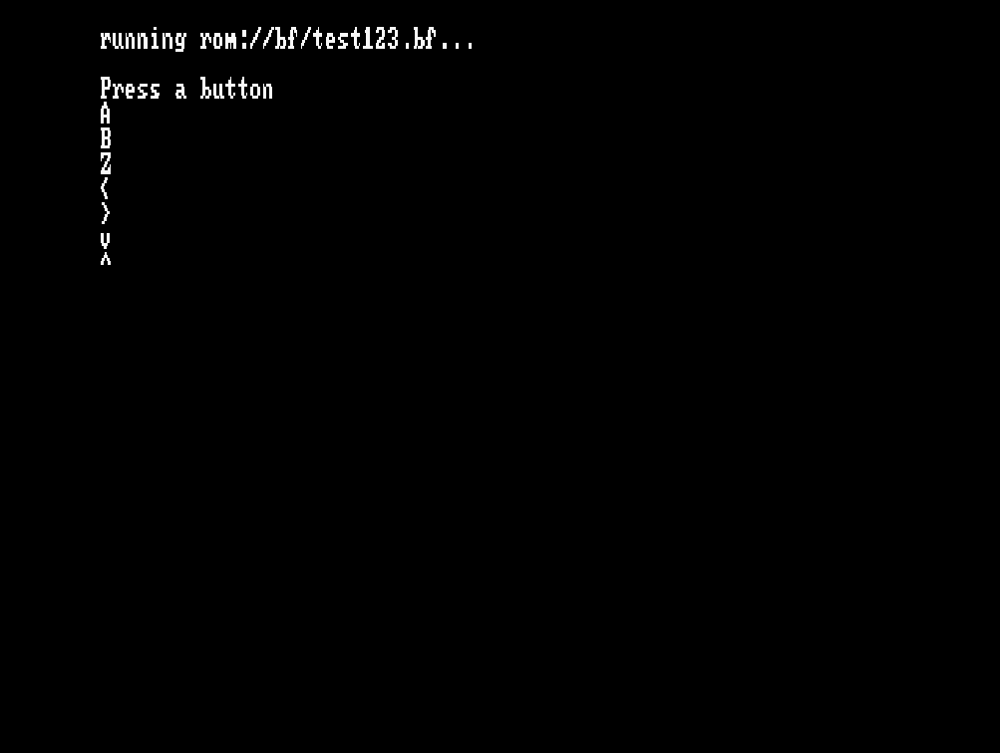

# Bf64

Brainfuck Interpreter for the Nintendo 64 using libdragon.

## Controls

Use the D-Pad to select a file at the main menu and press A to run it.
Press B after the program runned to return to the menu or A to run it again.

You can't interrupt a program while it's running, so you have to reset the console.

## Import Scripts

At the moment programs are loaded from a ROM Filesystem, so you have to link the ROM again against the new DFS to change the scripts.

Also only the `/bf` dir is accepted, no subfolders.

## Showcase

